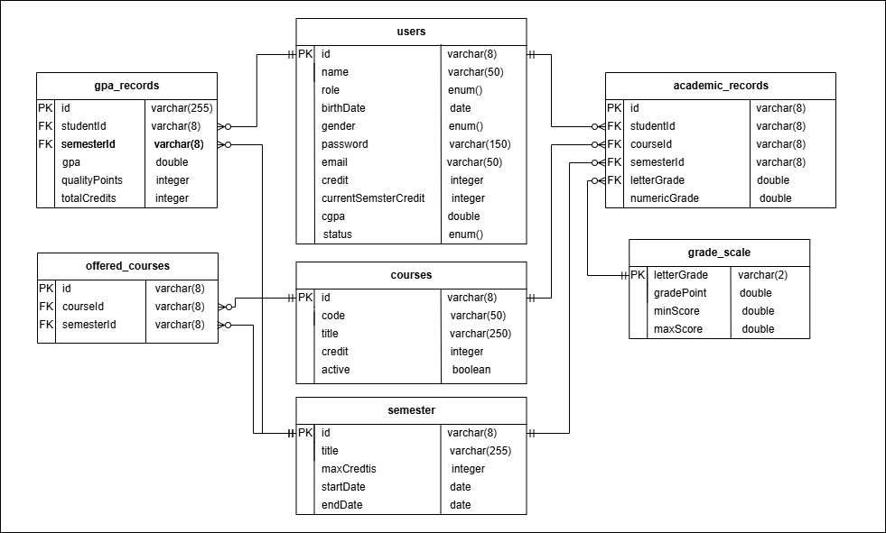

# Easy Learn - Educational Management System

Easy Learn is a web-based educational management system consisting of an **Admin Portal** and a **Student Portal**. The system enables administrators to manage academic data while providing students with an interface to view their academic information and register for available courses.

## Table of Contents

- [Overview](#overview)
- [Features](#features)
- [Technology Stack](#technology-stack)
- [Database](#database)
- [Authentication](#authentication)
- [Future Enhancements](#future-enhancements)
- [API Documentation](#api-documentation)

---

## Overview

Easy Learn is designed to simplify university academic management by providing separate portals for administrators and students.

Administrators can manage students, courses, semesters, and offered courses, while students can access their academic records, register for available courses, and monitor their academic progress.

---

## Features

### Administrator Capabilities

#### Dashboard
- View administrator basic information.
- View the currently active semester.
- Display today's date.
- Visualize student distribution by category.
- Monitor course statistics including:
  - Active courses
  - Archived courses
  - Offered courses

#### Student Management
- Filter students by course.
- Filter students by semester.
- Retrieve student details using Student ID.
- View student's current semester courses.
- Update course grades.
- Automatically recalculate GPA and CGPA through a background worker.

#### Course Management
- Filter courses by:
  - Course Code
  - Course Title
  - Status
- Add new courses.
- Update existing courses.

#### Offered Course Management
- View offered courses by semester.
- Add courses to a semester.
- Update offered courses.
- Delete offered courses.

#### Semester Management
- Filter semesters by title.
- Determine which semester was active on a specific date.
- Create new semesters.
- Update semester information.

---

### Student Capabilities

#### Homepage
- View personal information.
- View:
  - Current semester credits
  - Credit limit
  - Total cumulative credits
  - CGPA
  - GPA (when all current semester grades are available)
- Display currently registered courses.

#### My Courses
- View complete academic course history.

#### Available Courses
- View courses available for registration.
- Register for available courses based on remaining credit limit.

---

## Technology Stack

### Frontend

- React
- HTML
- CSS
- Tailwind CSS v3
- Redux
- TanStack React Query
- Offset Pagination

### Backend

- NestJS
- TypeScript
- PostgreSQL
- Sequelize ORM
- Redis
- BullMQ
- JWT Authentication

---

## Database

The database is built using PostgreSQL and Sequelize.

### Main Tables

- users
- courses
- semesters
- offered_courses
- academic_records

## Entity Relationship Diagram

---

## Authentication

The system uses JSON Web Tokens (JWT) for authentication.

---

## Future Enhancements

Future possible improvements include:

- Support user profile pictures.
- Generate academic transcripts.
- Download transcripts as PDF.
- Add Faculties and Departments.
- Introduce Instructor role.
- Create a dedicated Instructor Portal.
- Separate instructor permissions from administrator responsibilities.

---

## API Documentation

The API documentation is available on SwaggerHub.

https://app.swaggerhub.com/apis/punica-543/apis-documentation-for-easylearn-web-app/1.0

## Live Web Application 

I deployed the web application on Railway. you can access it through the following link:

https://easy-learn.up.railway.app/
